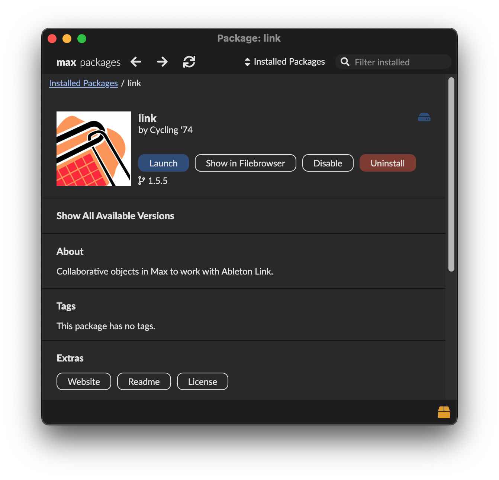
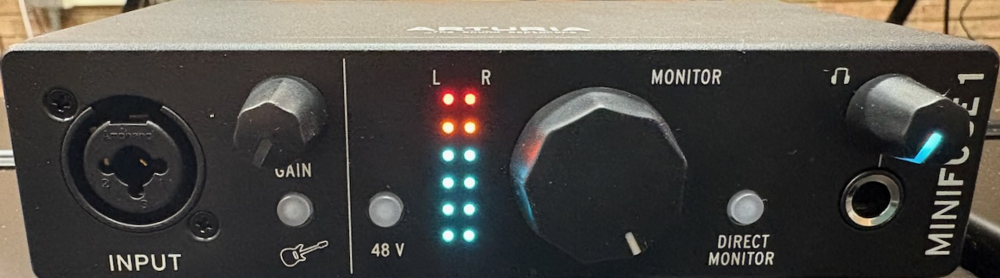
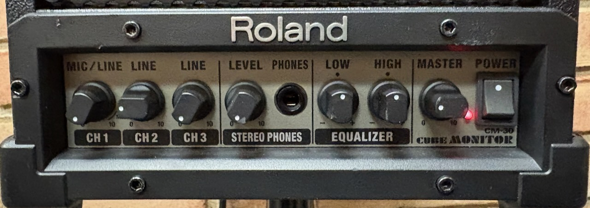
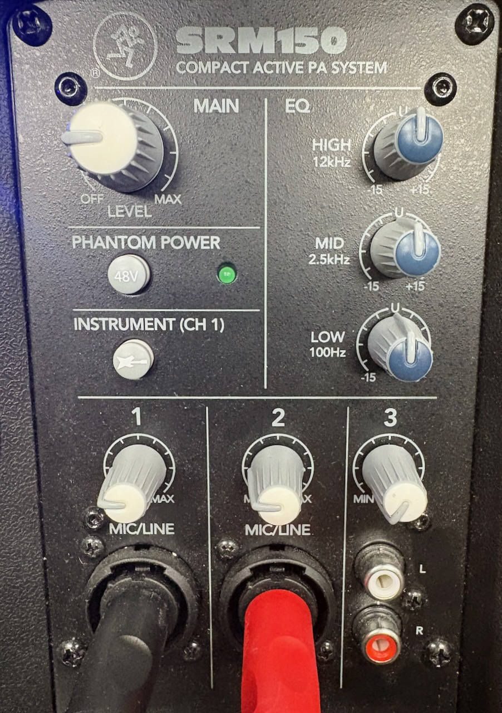
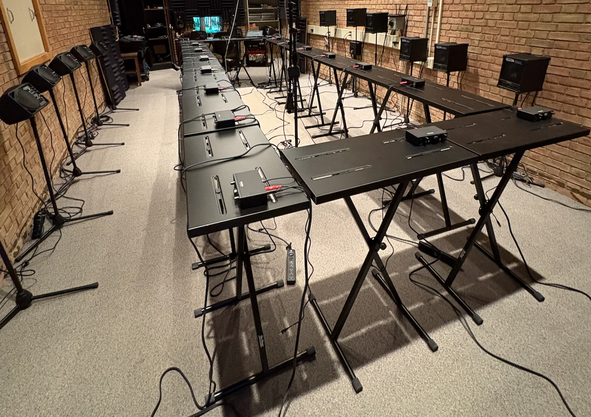

# MULE Fall 25 Kit

This repository includes configuration instructions and files needed to perform Fall 2025 concert selections. It will be updated with new content throughout the semester as needed.

## GitHub Desktop

MULE uses **GitHub Desktop** to manage and share files. It helps to ensure that all members have the exact same versions of everything and prevents unwanted changes. Download and install **GitHub Desktop** here:

https://desktop.github.com/download/

### Cloning Files With GitHub Desktop

After installation, open **GitHub Desktop** and either skip the login step or, optionally, login if you have an existing **GitHub** account. If you skip the login, you will be asked to enter your name and email address.

Next, select **Clone a Repository from the Internet...**. In the window that opens, go to the **URL** tab and copy-paste this address into the **Repository URL** field:

```
https://github.com/MULE-Ox/F25-Kit.git
```

The **Local Path** field should default to something like **Documents/GitHub/F25-Kit** - leave as-is and click **Clone**. You only need to perform this cloning procedure once at the beginning of the semester.

You should now have a collection of files in a folder called **F25-Kit** in **Documents/GitHub**. Make sure you can find it, and don't ever move it! You may want to add a shortcut to this folder on your Desktop, Taskbar (Windows), or Finder Sidebar (Mac).

### Updating Files With GitHub Desktop

At the beginning of _every_ class meeting, open **GitHub Desktop** and make sure that it says **F25-Kit** under **Current Repository** in the upper-left corner.

Just below that, look at the column that says **Changes**. If there are any changed files, go to the **Branch** menu in the menu bar and select **Discard All Changes...**.

Once it says "0 changed files" in the **Changes** column, look for a button in the upper-right corner that says either **Fetch origin** or **Pull origin** (depending on which state it is currently in). Click this button until it says "Last fetched just now" with no further updates.

### Create a "Safe" Folder

Occasionally, we will need individual MULE members to be able to create and change files that exist only in their own **F25-Kit** folder. To do so, simply create a new folder named **storage** inside of your **F25-Kit** folder. **GitHub Desktop** knows to ignore the contents of this folder when discarding files and syncing updates.

## Max

**Max** by Cycling '74 is a critical sound and visual application for MULE. Download and install the newest version here:

https://cycling74.com/downloads

You do not need a license to run files in **Max** for MULE. If you already have **Max** installed, make sure that it is updated to version **9.0.8** or higher.

### File Preferences

After installing **Max**, go to **Options > File Preferences...** in the menu bar. In the window that opens, click the **+** icon in the lower-left corner. Click the **choose** button in the new row that appears, then find the **F25-Kit** folder that you cloned from GitHub and click **Open**. Make sure that **Subfolders** is checked for that row.


If you have been in MULE in the past, please remove all folders from previous semesters in **File Preferences** using the **-** button. This will help prevent conflicts between files.

### Link

**Max** includes a **Package Manager** to install additional packages that add functionality to the base application. One that we use frequently in MULE to synchronize beats among players is **Link**.

To install **Link**, go to **File > Show Package Manager**, then search for **Link** by Cycling '74 and click the **Install** button. You do not need to launch **Link** after installing - it will automatically be available where needed in the **Max** patches that we build.



## Other Software

You may occasionally be asked to make "plain text" edits to files in your **storage** folder throughout the semester.

- Mac users should open and save these files with the **TextEdit** application.
- Windows users should open and save these files with the **Notepad** application.

## MULE Networks

MULE maintains its own wifi routers to improve network communication between group members. **MULE1** is the default router that is always active in CPA152. **MULE2** is a portable router that we use when needed in other rooms (e.g. when rehearsing small groups in other parts of the building).

Both networks use the same password:

```
moms-against-noise
```

Make sure that you can connect to **MULE1** when you arrive for class. Additionally, Windows users may need to disable the firewall for these networks (we will test this early in the semester).

## Hardware

### Arturia MicroFuse Audio Interface

Audio interfaces provide microphone and instrument inputs for every member and improve overall audio performance and quality.

Mac users will not need to install any drivers - the **MiniFuse** should automatically appear as an option for sound output.

Windows users will need to install the MiniFuse Control Center first:

https://www.arturia.com/products/audio/minifuse/resources#soft

In use, the front panel of your **MiniFuse** should look something like the image below, with the **Instrument**, **48 V**, and **DIRECT MONITOR** buttons off and the **MONITOR** level at maximum.



### Speakers

We have two different speaker models: the **Roland CM-30 CUBE** and **Mackie SRM150**. Spend some time getting familiar with your speaker's connections and controls.

Try to make sure that unused inputs are turned all the way down and, if you have a **Mackie**, the **PHANTOM POWER** and **INSTRUMENT** settings should always be off.





## Room Configuration

I have worked _very hard_ over the last few semesters to configure CPA152 to the best of my ability to meet the needs of both MULE and Souers Recital Hall. It's not a perfect space, but it is _ours_.

There are three room configuration items that I ask you to note and help maintain throughout the semester:

- If you are using a **Roland** speaker along the right (north) wall, some of them have been raised a bit to ensure that the cables on the back are not smashed against the plastic wire conduit.
- If you are using a **Mackie** speaker along the left (south) wall, the audio cables should be unplugged from the speaker inputs and loosely hung on the X-stand _at the end of every class_. This is to ensure a clear path to the back of the room.
- If you are using one of the two stations at the back of the room near the recording desk, there isn't quite enough room to leave the speakers out all the time. You will need to move your speakers a few feet away from your stand and plug in their power cables at the start of every class. A power strip is stored at the bottom of the mixer rack for this purpose. Please make sure to return both the power strip and speakers to their stored locations _at the end of every class_.


